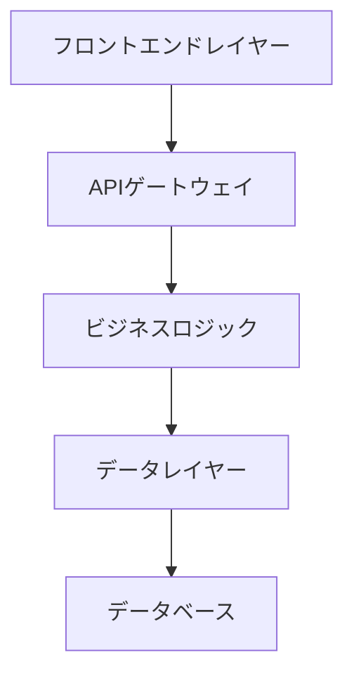
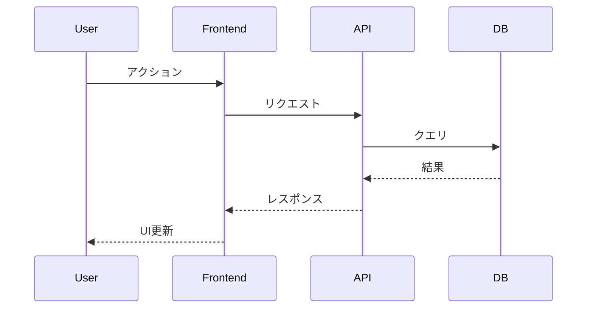
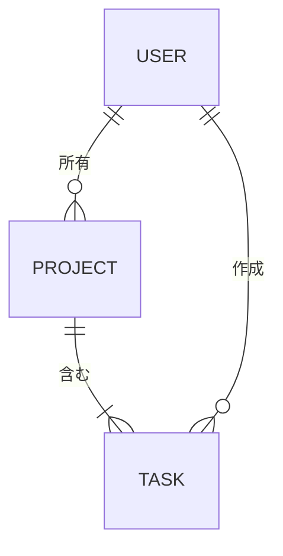

# 技術設計

機能の包括的な技術設計を作成: **$ARGUMENTS**

## インタラクティブ承認: 要件レビュー

**重要**: 設計は要件がレビューおよび承認された後にのみ生成できます。

### 要件レビュープロセス

- 要件文書: @spec/specs/$ARGUMENTS/requirements.md
- 仕様メタデータ: @spec/specs/$ARGUMENTS/spec.json

**インタラクティブ承認プロセス**:

1. **要件が存在するか確認** - requirements.mdが生成されていることを確認
2. **人間によるレビューをプロンプト** - ユーザーに確認: "requirements.mdをレビューしましたか？ [y/N]"
3. **'y' (はい)の場合**: spec.jsonを自動的に更新して要件を承認し、設計生成を続行
4. **'N' (いいえ)の場合**: 実行を停止し、最初にrequirements.mdをレビューするようユーザーに指示

**ユーザーがレビューを確認したときのspec.jsonの自動承認更新**:

```json
{
  "approvals": {
    "requirements": {
      "generated": true,
      "approved": true // ← ユーザーが確認したとき自動的にtrueに設定
    }
  },
  "phase": "requirements-approved"
}
```

**ユーザーインタラクションの例**:

```
📋 設計生成前に要件レビューが必要です。
📄 レビューしてください: spec/specs/feature-name/requirements.md
❓ requirements.mdをレビューしましたか？ [y/N]: y
✅ 要件を自動的に承認しました。設計生成を続行します...
```

## コンテキスト分析

### 要件の基盤

**重要**: 設計は承認された要件文書に基づいて構築される必要があります。

- **要件文書**: @spec/specs/$ARGUMENTS/requirements.md
- **EARS形式の要件**: 受け入れ基準を含む各要件
- **ユーザーストーリーのマッピング**: 設計コンポーネントは特定のユーザーストーリーに対応する必要があります
- **制約と受け入れ基準**: 技術的決定に反映される必要があります

**必要な検証**: 続行する前にrequirements.mdが存在し承認されていることを確認してください。

### ステアリングコンテキスト

- 現在のアーキテクチャ: @spec/steering/structure.md
- 技術スタック: @spec/steering/tech.md
- プロダクト制約: @spec/steering/product.md

### 現在の仕様コンテキスト

- 現在の設計: @spec/specs/$ARGUMENTS/design.md
- 仕様メタデータ: @spec/specs/$ARGUMENTS/spec.json

## タスク: 技術設計の作成

**前提条件の確認**: 要件が承認され、設計フェーズの準備ができています。

### リサーチ＆調査プロセス

**必須**: 設計プロセス中にリサーチと調査を実施：

1. **技術リサーチ**
   - 技術スタックの現在のベストプラクティスをリサーチ
   - セキュリティの考慮事項と最新の標準を調査
   - パフォーマンスベンチマークとスケーリングアプローチをレビュー
   - 既存のアーキテクチャとの統合パターンを調査

2. **コンテキスト構築**
   - 会話スレッドでリサーチコンテキストを構築
   - 設計決定に影響を与える主要な発見を文書化
   - ソースを引用し、参照用の関連リンクを含める
   - アーキテクチャの選択に影響を与える洞察を要約

3. **要件分析**
   - 各設計コンポーネントを特定のEARS要件にマッピング
   - すべてのユーザーストーリーが技術設計で対処されていることを確認
   - 提案されたソリューションで受け入れ基準を満たせることを検証
   - 要件と技術的実現可能性の間のギャップを特定

### 設計文書の生成

spec.jsonで指定された言語でリサーチ結果を組み込んだ包括的な設計文書を生成：

### 1. 設計文書の構造

spec.jsonで指定された言語でdesign.mdを作成（`@spec/specs/$ARGUMENTS/spec.json`の`"language"`フィールドを確認）：

````markdown
# 技術設計

この文書は要件 @requirements.md を元に作成された、技術設計書です。

## 概要

[実装アプローチの技術的概要、requirements.mdからの主要要件を参照]

## 要件マッピング

### 設計コンポーネントのトレーサビリティ

各設計コンポーネントは特定の要件に対応：

- **[コンポーネント1]** → REQ-X.X: [EARS要件参照]
- **[コンポーネント2]** → REQ-Y.Y: [EARS要件参照]
- **[統合レイヤー]** → REQ-Z.Z: [EARS要件参照]

### ユーザーストーリーカバレッジ

[requirements.mdからのすべてのユーザーストーリーが対処されていることを確認]

- ユーザーストーリー1: [設計がこのストーリーにどう対応するか]
- ユーザーストーリー2: [このストーリーへの技術的アプローチ]

## アーキテクチャ

[高レベルのシステムアーキテクチャと技術的決定]


````

### 技術スタック

[リサーチ結果と要件分析に基づく]

- **フロントエンド**: [Vite/Webpack/Next.js/Astro] + [React] + [TypeScript]
- **バックエンド**: [FastAPI/Express/Django] + [言語]
- **データベース**: [PostgreSQL/MySQL/MongoDB]
- **認証**: [JWT/OAuth/Auth0]
- **テスト**: [Vitest/Jest/pytest] + [Testing Library/Playwright]
- **デプロイ**: [Docker/Vercel/AWS]

### アーキテクチャ決定の根拠

[リサーチに基づく主要な技術選択の理由を文書化]

- **なぜ[フロントエンドフレームワーク]**: [リサーチに基づく正当化]
- **なぜ[バックエンド技術]**: [パフォーマンス、スケーラビリティ、チームの専門知識の考慮]
- **なぜ[データベース選択]**: [データモデル要件、一貫性のニーズ、スケーリングパターン]
- **なぜ[認証方法]**: [セキュリティ要件、統合機能、ユーザーエクスペリエンス]

## データフロー

[システム内でデータがどのように流れるかの説明]

### 主要なユーザーフロー

上位1〜3つのユーザーフローのシーケンス図を含める：



## コンポーネントとインターフェース

包括的なコンポーネントの内訳を生成。

### バックエンドサービスとメソッドシグネチャ

要件で特定された各サービスについて、簡潔なドキュメント文字列を含むパブリックメソッドをリスト。例（Python）：

```python
class InvoiceService:
    def create_invoice(self, data: InvoiceData) -> Invoice:  # 作成＆永続化
    def send_invoice(self, invoice_id: str) -> None          # メール/送信
```

### フロントエンドコンポーネント

テーブルを提供: コンポーネント名 │ 責任 │ Props/state概要。

### APIエンドポイント

詳細なAPIエンドポイントテーブルを提供：

| メソッド | ルート              | 目的         | 認証 | ステータスコード        |
| -------- | ------------------- | ------------ | ---- | ----------------------- |
| GET      | /api/[リソース]     | リソース一覧 | 必須 | 200, 401, 500           |
| POST     | /api/[リソース]     | リソース作成 | 必須 | 201, 400, 401, 500      |
| PUT      | /api/[リソース]/:id | リソース更新 | 必須 | 200, 400, 401, 404, 500 |
| DELETE   | /api/[リソース]/:id | リソース削除 | 必須 | 204, 401, 404, 500      |

## データモデル

### ドメインエンティティ

1. **[エンティティ1]**: [簡潔な説明]
2. **[エンティティ2]**: [簡潔な説明]
3. **[エンティティ3]**: [簡潔な説明]

### エンティティリレーションシップ



### データモデル定義

言語固有のモデルを提供（TypeScriptインターフェースおよび/またはPythonデータクラス）：

```typescript
interface [モデル名] {
  id: string;
  // 要件に基づいて関連フィールドを追加
  createdAt: Date;
  updatedAt: Date;
}
```

```python
@dataclass
class [モデル名]:
    id: str
    # 要件に基づいて関連フィールドを追加
    created_at: datetime
    updated_at: datetime
```

### データベーススキーマ

[SQLスキーマまたはNoSQLドキュメント構造]

### マイグレーション戦略

- スキーマ変更のマイグレーションアプローチ
- 後方互換性の考慮事項
- データ変換要件
- パフォーマンスのためのインデックス戦略

## エラーハンドリング

[包括的なエラーハンドリング戦略]

## セキュリティの考慮事項

### 認証と認可

- シーケンス図を含む認証フロー（JWT/OAuth）
- 認可マトリックス（ロールと権限）
- セッション管理戦略

### データ保護

- 入力検証アプローチ
- 保存時および転送時のデータ暗号化
- 機密データの取り扱い

### セキュリティベストプラクティス

- OWASP Top 10の軽減戦略
- APIレート制限
- CORS設定
- セキュリティヘッダーの実装

## パフォーマンスとスケーラビリティ

### パフォーマンス目標

| メトリック               | 目標           | 測定              |
| ------------------------ | -------------- | ----------------- |
| レスポンス時間 (p95)     | < 200ms        | APIエンドポイント |
| レスポンス時間 (p99)     | < 500ms        | APIエンドポイント |
| スループット             | > 1000 req/sec | 負荷テスト        |
| データベースクエリ (p99) | < 50ms         | クエリ監視        |
| 同時ユーザー             | > 10,000       | システム容量      |

### キャッシング戦略

- **ブラウザキャッシュ**: 静的アセット、APIレスポンス
- **CDN**: メディアファイル、静的コンテンツ
- **アプリケーションキャッシュ**: セッションデータ用のRedis/Memcached
- **データベースキャッシュ**: クエリ結果のキャッシング

### スケーラビリティアプローチ

- アプリケーションサーバーの水平スケーリング
- データベースの読み取りレプリカ
- 非同期処理用のバックグラウンドジョブキュー
- 負荷メトリクスに基づく自動スケーリング

## テスト戦略

### テストカバレッジ要件

- **ユニットテスト**: ≥80%のコードカバレッジ
- **統合テスト**: すべてのAPIエンドポイントと外部統合
- **E2Eテスト**: 重要なユーザージャーニー
- **パフォーマンステスト**: 予想ピークの2倍での負荷テスト

### テストアプローチ

1. **ユニットテスト**
   - 個々の関数とメソッドをテスト
   - 外部依存関係をモック
   - ビジネスロジックに焦点

2. **統合テスト**
   - APIコントラクトテスト
   - データベース統合テスト
   - 外部サービス統合テスト

3. **エンドツーエンドテスト**
   - ユーザー認証フロー
   - コア機能ワークフロー
   - クロスブラウザ互換性

4. **パフォーマンステスト**
   - k6または類似ツールによる負荷テスト
   - システム限界のストレステスト
   - メモリリークの耐久テスト

### CI/CDパイプライン


### 2. ドキュメント生成

設計ドキュメントのコンテンツのみを生成。実際のドキュメントファイルにレビューや承認の指示を含めないでください。

### 3. メタデータの更新

spec.jsonを更新：

```json
{
  "phase": "design-generated",
  "approvals": {
    "requirements": {
      "generated": true,
      "approved": true
    },
    "design": {
      "generated": true,
      "approved": false
    }
  },
  "updated_at": "現在のタイムスタンプ"
}
```

---

## インタラクティブ承認の実装（ドキュメントに含まれない）

以下はClaude Codeの会話専用 - 生成されたドキュメントには含まれません：

### インタラクティブ承認プロセス

このコマンドはインタラクティブ承認を実装：

1. **要件レビュープロンプト**: ユーザーに要件レビューの確認を自動的にプロンプト
2. **自動承認**: ユーザーが'y'で確認したときspec.jsonを自動的に更新
3. **設計生成**: 承認後すぐに続行
4. **次のフェーズ**: 設計が生成され、`/spec:tasks`によるインタラクティブ承認の準備完了

### 次のフェーズの設計レビュー

design.mdを生成した後、次のフェーズ（`/spec:tasks $ARGUMENTS`）は同様のインタラクティブ承認を使用：

**次のインタラクションのプレビュー**:

```
📋 タスク生成前に設計レビューが必要です。
📄 レビューしてください: spec/specs/feature-name/design.md
❓ design.mdをレビューしましたか？ [y/N]:
```

### レビューチェックリスト（ユーザー参照用）：

- [ ] 技術設計が包括的で明確
- [ ] アーキテクチャが既存システムと整合
- [ ] 技術選択が適切
- [ ] コンポーネントとインターフェースが明確に定義されている
- [ ] セキュリティとパフォーマンスの考慮事項が対処されている

## 指示

1. **要件の基盤を確認** - requirements.mdが存在し承認されていることを確認
2. **spec.jsonで言語を確認** - メタデータで指定された言語を使用
3. **包括的なリサーチを実施**：
   - 技術のベストプラクティスと最新の標準をリサーチ
   - セキュリティ、パフォーマンス、統合の考慮事項を調査
   - 会話スレッドでリサーチ結果を通じてコンテキストを構築
   - 設計決定に影響を与えるソースと主要な洞察を文書化
4. **要件を徹底的に分析**：
   - 各設計コンポーネントを特定のEARS要件にマッピング
   - すべてのユーザーストーリーが技術設計で対処されていることを確認
   - 提案されたソリューションで受け入れ基準を満たせることを検証
5. ステアリングコンテキストから**既存のアーキテクチャパターンに従う**
6. **ドキュメントを論理的な順序で構造化**：
   - 概要 → リサーチ＆コンテキスト → 要件マッピング → アーキテクチャ → データフロー → コンポーネント → データモデル → エラーハンドリング → セキュリティ → パフォーマンス → テスト
7. 明確なインターフェースとAPI仕様を持つ**詳細なコンポーネント設計を作成**
8. アーキテクチャ、データフロー、ERダイアグラムにmermaidを使用した**包括的なダイアグラムを含める**
9. **設計の根拠を文書化** - 主要な技術的決定の背後にある理由を説明
10. **第三者による一次レビュー** - ここまでで一度、Geminiにレビューしてもらいましょう。`gemini -p 'spec/specs/$ARGUMENTS/design.mdをレビューしてください。なお、テスト戦略定義の前段階で、パフォーマンス指標、テスト戦略は後ほど追記される予定です。'` を実行し、指摘内容から修正すべき点を修正しましょう
11. **具体的なパフォーマンス目標を定義**し、テスト戦略を定義
12. **第三者による最終レビュー** - ユーザに見せる前に、Gemini にレビューしてもらいましょう。`gemini -p 'spec/specs/$ARGUMENTS/design.mdをレビューしてください'` を実行し、指摘内容から修正すべき点を修正しましょう
13. 完了時に**追跡メタデータを更新**

徹底的なリサーチと明示的な要件トレーサビリティに基づいて、スケーラビリティ、セキュリティ、保守性を適切に考慮した実装フェーズの明確な設計図を提供する設計を生成します。
